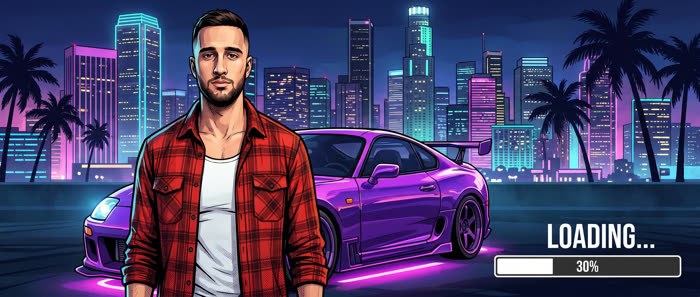

# Enter The Game — how I get inside video games

I sit down at my PS5, press a button, and end up inside the game. Here's exactly how it's done.

🇷🇺 [Читать по-русски](README.ru.md)

**You need:** Higgsfield (~$15/mo), CapCut (free), 25 photos of yourself. The first video takes an evening, after that about an hour.

---

## The one rule that matters

Don't ask for "a video". **Give the model two pictures — the first frame and the last — and describe what happens in between.**

I burned four attempts trying to make my character get in on the driver's side using words: "left door", "the side nearest the camera", "don't walk around the car". He got in on the wrong side every time. It worked the moment I drew a frame where he's *already behind the wheel* and handed that over as the last frame.

So the order is always: **pictures first, video second.** A picture costs 2 credits, a video costs 12.

---

## 1. Your face

25–30 photos: close-up front, 4 each at three-quarters left and right, 2 profiles, waist-up, full body, a few expressions.

Even light by a window, same haircut and beard in every shot. No glasses, caps, filters, or photos from different years — otherwise the model averages them and you get your cousin instead of you.

**Higgsfield → Soul → Soul ID → Create.** Upload, name it, wait five minutes.

Then generate one clean portrait and save it as an **Element** (`Save as Element`). The Element is "you" that works in every model — Soul ID on its own only works inside Soul.


---

## 2. Your room

Photograph your own — vertical, no people in frame. Better than generating one: instantly recognisable, and free.


From that single photo you generate every camera angle: **Image → Nano Banana Pro → Multi-reference**, attach the photo, describe where to move the camera.


Every prompt starts with the same anchor sentence — that's what keeps the room identical:

```
Use the reference image as the exact same room: same walls, same desk, same monitor,
same PS5, same shelf, same lamp, same LED strip, same chair.
Do not add a PC tower. Do not add people.
```

Then only the camera: `Move the camera behind the gaming chair` / `Place the camera where the monitor is, looking back at the chair` / `Camera in front of the monitor, perpendicular`.

Two habits that save you: write LEFT and RIGHT in caps, and always state what must **not** be there — otherwise it invents a PC tower and random people.

**Keep the monitor screen black everywhere.** Whatever appears on it gets composited in CapCut later: models can't draw interfaces or readable text, you'll get gibberish.

---

## 3. The home part

Three clips: intro 5s → button press 3s → getting pulled in 5s.

Frames first (Nano Banana Pro + Element), then video (Kling 3.0, Start + End frame, Pro mode, sound off).


**The expression is not surprise.** My first versions had him shocked — open mouth, hands flying. It looks stupid. The right read is: he knows exactly what's coming. Confident half-smile, cold stare, anger, hood up. In the video prompt: `No surprise, no big reaction.`

And always: `Camera locked on a tripod, no camera movement` — otherwise Kling drifts the camera into the wall.

---

## 4. The portal

I rebuilt this five times. Here's the difference:

| Works | Doesn't work |
|---|---|
| Black screen + one short flash | Light rays flooding the whole room |
| Side or top angle | A lunge "at the camera" — the character ends up screaming |
| Physics: body goes through the screen like water, controller drops, chair rolls back | Swirls, spirals, particles |
| `practical-effect realism, no glow, no light rays` | `epic VFX, energy, magical` |


Realism doesn't come from the effect itself. It comes from the consequences: the dropped controller and the chair rolling away.

---

## 5. Inside the game

You draw the whole chain of key frames first, look at them, and only then generate the video between them.


Five frames: runs out of the portal → opens the driver's door → car pulls away → drift with a portal opening ahead → empty street.

Three clips between them on **MiniMax H3** (12 credits for 6s, 2K — and it returns video **with its own audio**: engine and tyres land exactly on picture).


**Never cut in the middle of a continuous action.** I first made the drift and the portal entry as two 5-second clips — the cut landed mid-slide and the car stuttered. One 10-second clip fixed it.

To make the game obvious, generate your own loading screen with yourself on the key art and composite it onto the black monitor. No borrowed screenshots, nothing to get flagged for.



---

## 6. The outro

One outro for every video, mirroring the portal: empty chair → flash → he's thrown **back out of the monitor** into the chair → catches the controller → looks into the lens → **2-second freeze** for your text.


Shoot it head-on — from the side the face is small and drifts. Don't bake the text into the generation, add it in CapCut.

---

## 7. Assembly

CapCut, 9:16. Straight cuts, no transitions: intro → press → pull-in → white layer 0.3s → game → outro.

To put content on the monitor: place it above → **Distort** by the four corners of the screen → blend mode **Screen** → Glow 10–20%.

Audio: keep the native track from the game clips, add library sounds for the home part — chair creak, controller click, riser, the flash "zap", the controller hitting the floor. Music goes on later, at publishing.

---

## What breaks most often

| Symptom | Fix |
|---|---|
| Face doesn't look like you | Element in every prompt with a person; on wide shots attach 4 portraits at once |
| Room changes every time | Anchor sentence + master frame as reference |
| It invented a PC tower, or people | Spell out what must not be there |
| Camera drifts away | `Camera locked on a tripod` |
| Portal looks cheap | Black screen, one flash, physics |
| Got in on the wrong side of the car | Make "already behind the wheel" the last frame |
| Drift stutters | Long action = one clip |
| Image came out rotated | `Vertical 9:16, horizon horizontal, upright composition` |

---

## What it costs

| Item | Credits |
|---|---|
| Key frame (Nano Banana Pro, 2k) | 2 |
| **MiniMax H3, 6s / 10s (2K)** | **12 / 20** |
| Kling 3.0 Pro, 3s / 5s | 5 / 9 |
| Seedance 2.0, 10s 1080p | 110 ⚠️ |

The foundation — face, room, home part, outro — is about 400 credits, once. Each new game after that is about 50.

---

Questions — drop them in the comments under any video, I answer everyone.
