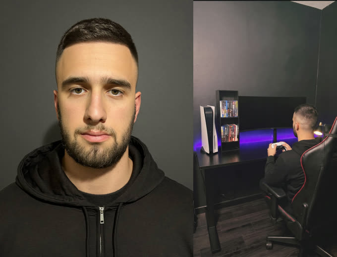
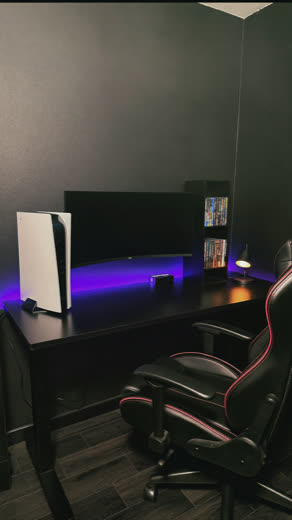
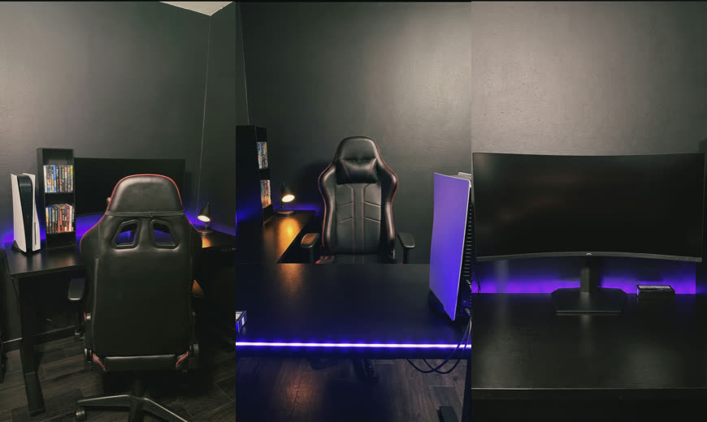
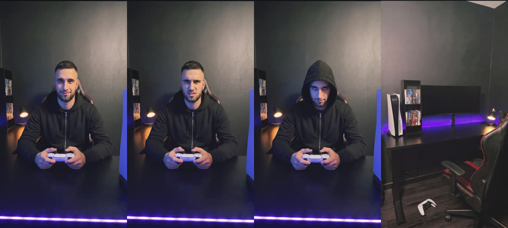
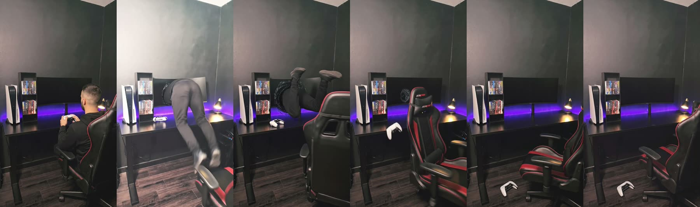
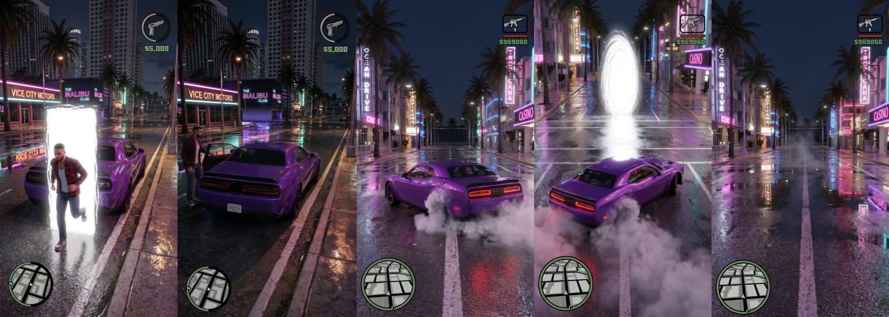
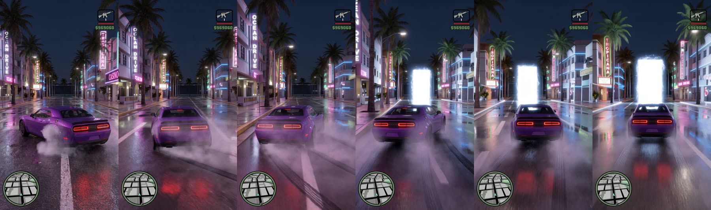
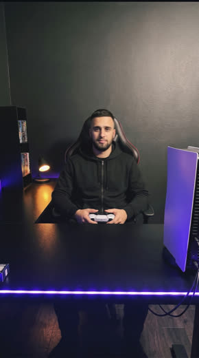

# Как я захожу в игры — туториал

Сажусь за PS5, нажимаю кнопку — и оказываюсь внутри игры. Вот как это сделано.

**Нужно:** Higgsfield (~15 $/мес), CapCut (бесплатно), 25 своих фото. Первый ролик — вечер, дальше час.

---

## Главное правило

Не проси «сделай видео». **Дай две картинки — первый кадр и последний — и опиши, что между ними.**

Я четыре раза пытался словами заставить персонажа сесть с водительской стороны: «левая дверь», «ближняя к камере», «не обходи машину». Каждый раз садился не туда. Сработало, когда я нарисовал кадр «он уже за рулём» и отдал его как последний.

Поэтому порядок такой: **сначала картинки, потом видео.** Картинка стоит 2 кредита, видео — 12.

---

## 1. Лицо

25–30 фото: анфас крупно, по 4 в три четверти влево и вправо, 2 профиля, по пояс, в полный рост, разные эмоции.

Ровный свет у окна, один и тот же вид (причёска, борода), никаких очков, кепок, фильтров и фото за разные годы — иначе нейросеть усреднит и получится твой брат.

**Higgsfield → Soul → Soul ID → Create.** Загрузил, назвал, ждёшь 5 минут.

Дальше: сгенерируй один чистый портрет и сохрани его как **Element** (`Save as Element`). Element — это «ты», который работает во всех моделях, а Soul ID сам по себе только в Soul.



---

## 2. Комната

Сфотографируй свою — вертикально, без людей. Это лучше генерации: узнаваемо и бесплатно.



Дальше из одного фото делаешь ракурсы: **Image → Nano Banana Pro → Multi-reference**, прикрепляешь фото, пишешь, куда переставить камеру.



Промпт всегда начинается с одной фразы — она держит комнату:

```
Use the reference image as the exact same room: same walls, same desk, same monitor,
same PS5, same shelf, same lamp, same LED strip, same chair.
Do not add a PC tower. Do not add people.
```

Дальше только про камеру: `Move the camera behind the gaming chair` / `Place the camera where the monitor is, looking back at the chair` / `Camera in front of the monitor, perpendicular`.

Два правила: писать ЛЕВО и ПРАВО капсом, и всегда указывать, чего быть **не должно** — иначе дорисует системник и людей.

**Экран монитора везде чёрный.** Всё, что на нём, накладывается потом в CapCut: нейросети не умеют рисовать интерфейсы, будет абракадабра.

---

## 3. Домашняя часть

Три клипа: интро 5 с → нажатие 3 с → затягивание 5 с.

Сначала кадры (Nano Banana Pro + Element), потом видео (Kling 3.0, Start + End frame, Pro, звук off).



**Эмоция — не удивление.** Первые версии я делал «он в шоке» — открытый рот, руки в стороны, выглядит глупо. Правильно: он знает, что сейчас будет. Уверенная полуулыбка, холодный взгляд, злость, капюшон. В промпт видео: `No surprise, no big reaction.`

И всегда: `Camera locked on a tripod, no camera movement` — иначе Kling увезёт камеру в стену.

---

## 4. Портал

Переделывал пять раз. Вот разница:

| Работает | Не работает |
|---|---|
| Чёрный экран + одна короткая вспышка | Свет с лучами на всю комнату |
| Вид сбоку или сверху | Рывок «на камеру» — персонаж орёт |
| Физика: тело уходит в экран как в воду, геймпад падает, кресло откатывается | Вихри, спирали, частицы |
| `practical-effect realism, no glow, no light rays` | `epic VFX, energy, magical` |



Реализм дают не эффекты, а последствия: упавший геймпад и откатившееся кресло.

---

## 5. Игровая часть

Рисуешь цепочку ключевых кадров, показываешь себе, и только потом делаешь видео между ними.



Пять кадров: выбежал из портала → открыл водительскую дверь → машина сорвалась с места → дрифт, впереди открывается портал → пустая улица.

Три клипа между ними на **MiniMax H3** (12 кредитов за 6 с, 2K, и он отдаёт видео **со своим звуком** — мотор и шины попадают в кадр точно).



**Непрерывное действие не режь катом.** Сначала я сделал дрифт и заезд в портал двумя клипами по 5 с — кат пришёлся на середину заноса, машина дёргалась. Один клип на 10 с — плавно.


---

## 6. Аутро

Одно на все ролики, зеркалит портал: пустое кресло → вспышка → выбрасывает из монитора обратно в кресло → ловит геймпад → смотрит в камеру → **стоп-кадр 2 секунды** под текст.



Делай фронтально — сбоку лицо мелкое и плывёт. Текст не вшивай в генерацию, добавляй в CapCut.

---

## 7. Сборка

CapCut, 9:16. Встык без переходов: интро → нажатие → затягивание → белый слой 0.3 с → игра → аутро.

Картинку на монитор: положить поверх → **Distort** по четырём углам экрана → режим **Screen** → Glow 10–20 %.

Звук: из игровых клипов берёшь родной, для домашней части добавляешь из библиотеки CapCut — скрип кресла, клик геймпада, riser, «зап» вспышки, падение геймпада. Музыку — уже при публикации в Instagram.

---

## Что ломается чаще всего

| Симптом | Решение |
|---|---|
| Лицо не похоже | Element в каждый промпт с человеком; на дальних планах — 4 портрета сразу |
| Комната каждый раз разная | Якорная фраза + мастер-кадр в референс |
| Дорисовал системник, людей | Писать, чего быть не должно |
| Камера уезжает | `Camera locked on a tripod` |
| Портал дешёвый | Чёрный экран, одна вспышка, физика |
| Сел не с той стороны | Кадр «уже за рулём» как последний |
| Дрифт дёргается | Длинное действие — одним клипом |
| Картинка повернулась | `Vertical 9:16, horizon horizontal, upright composition` |

---

## Цены

| Что | Кредиты |
|---|---|
| Картинка-кадр (Nano Banana Pro 2k) | 2 |
| **MiniMax H3, 6 с / 10 с (2K)** | **12 / 20** |
| Kling 3.0 Pro, 3 с / 5 с | 5 / 9 |
| Seedance 2.0, 10 с 1080p | 110 ⚠️ |

Фундамент (лицо, комната, домашняя часть, аутро) — около 400 кредитов один раз. Новая игра — около 50.

---

Вопросы — пиши в комментарии под роликом, отвечу по любому шагу.

---

*Если что-то не получилось — напиши в комментариях под роликом, разберём.*
